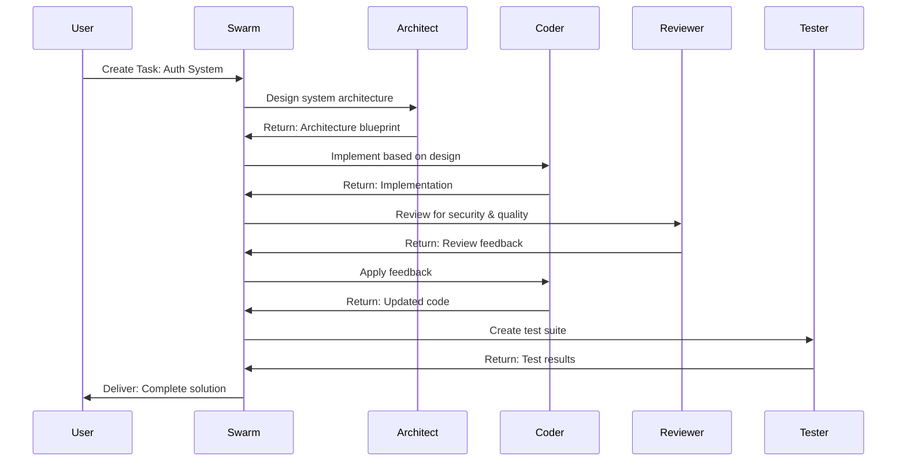

# Multi-Model Agent Swarm - Configuration Summary

**Created:** 2026-02-03
**Status:** Active and Ready

---

## 🎯 Swarm Architecture

### V3 Hierarchical-Mesh Topology

```
┌─────────────────────────────────────────────────────────┐
│             SWARM COORDINATOR                           │
│         swarm-1770103558768 (V3 Mode)                  │
│                                                         │
│  Features:                                             │
│  • Flash Attention (2.49x-7.47x speedup)               │
│  • AgentDB Integration (150x faster search)            │
│  • SONA Learning System                                │
│  • Max 15 agents, Auto-scaling enabled                 │
└─────────────────────────────────────────────────────────┘
                         │
        ┌────────────────┼────────────────┐
        │                │                │
    ┌───▼───┐       ┌───▼───┐       ┌───▼───┐
    │Claude │       │ GPT-4 │       │Workers│
    │Agents │       │Agents │       │Daemon │
    └───┬───┘       └───┬───┘       └───┬───┘
        │                │                │
  ┌─────┴─────┐    ┌────┴────┐     ┌────┴────┐
  │           │    │         │     │         │
  ▼           ▼    ▼         ▼     ▼         ▼
Coder    Architect Reviewer Tester Map    Audit
(Claude)  (Claude) (GPT-4o) (GPT-4) Optimize...
```

---

## 🤖 Deployed Agents

### Anthropic Claude Agents (2)

| Agent | Type | Model | Status | Capabilities |
|-------|------|-------|--------|--------------|
| **coder-ml69yl2t** | Coder | claude-3.5-sonnet-20241022 | Idle | code-generation, refactoring, debugging |
| **architect-ml69ynlq** | Architect | claude-3.5-sonnet (default) | Idle | system-design, pattern-analysis, scalability |

### OpenAI GPT Agents (2)

| Agent | Type | Model | Status | Capabilities |
|-------|------|-------|--------|--------------|
| **reviewer-ml69yt32** | Reviewer | gpt-4o | Idle | code-review, security-audit, quality-analysis |
| **tester-ml69ywa4** | Tester | gpt-4-turbo | Idle | unit-testing, integration-testing, coverage-analysis |

**Total Active Agents:** 5
**Provider Distribution:**
- Anthropic Claude: 40% (2 agents)
- OpenAI GPT: 40% (2 agents)
- Background Workers: 20% (5 workers)

---

## 📋 Active Tasks

### High Priority: User Authentication System

**Task ID:** task-1770103602188-8y0xfp
**Type:** Implementation
**Priority:** High
**Status:** Pending (Ready for assignment)

**Description:**
Design and implement a user authentication system with JWT tokens, password hashing, and rate limiting

**Recommended Agent Assignment:**
1. **Architect** (Claude) → System design and architecture
2. **Coder** (Claude) → Core implementation
3. **Reviewer** (GPT-4o) → Security audit and code review
4. **Tester** (GPT-4 Turbo) → Test coverage and validation

---

## 🔄 Workflow Example



---

## 🎛️ System Status

### Swarm Coordination
- **Swarm ID:** swarm-1770103558768
- **Topology:** hierarchical-mesh
- **Max Agents:** 15
- **Auto Scale:** ✓ Enabled
- **V3 Mode:** ✓ Enabled
- **Protocol:** message-bus

### Background Workers (5 Active)
- ✓ **map** - Task routing and distribution
- ✓ **audit** - Code quality monitoring
- ✓ **optimize** - Performance optimization
- ✓ **consolidate** - Memory consolidation
- ✓ **testgaps** - Test coverage analysis

### AI Provider Status
- ✅ Anthropic: Connected (claude-3.5-sonnet, opus)
- ✅ OpenAI LLM: Connected (gpt-4o, gpt-4-turbo)
- ✅ OpenAI Embeddings: Connected (text-embedding-3-small/large)
- ✅ Local Embeddings: Active (Transformers.js, Agentic Flow)

---

## 📊 Performance Features

### V3 Enhancements Active
- **Flash Attention:** 2.49x-7.47x speedup for inference
- **AgentDB with HNSW:** 150x-12,500x faster vector search
- **SONA Learning:** Sub-0.05ms adaptive learning
- **EWC++:** No catastrophic forgetting
- **Hyperbolic Embeddings:** Poincaré space for hierarchical data

### Memory & Learning
- **Backend:** Hybrid (SQL + Vector)
- **Vector Embeddings:** ✓ Enabled (384-dim)
- **Pattern Learning:** ✓ Enabled
- **Temporal Decay:** ✓ Enabled
- **HNSW Indexing:** ✓ Enabled

---

## 🚀 Usage Commands

### Assign Task to Agents
```bash
# Assign to specific agent
npx claude-flow@alpha task assign task-1770103602188-8y0xfp --agent architect-ml69ynlq

# Or let swarm auto-distribute
npx claude-flow@alpha swarm distribute --task task-1770103602188-8y0xfp
```

### Monitor Progress
```bash
# Check swarm status
npx claude-flow@alpha swarm status swarm-1770103558768

# View task progress
npx claude-flow@alpha task status task-1770103602188-8y0xfp

# List all agents
npx claude-flow@alpha agent list

# Check specific agent
npx claude-flow@alpha agent status architect-ml69ynlq
```

### Spawn Additional Agents
```bash
# Add more Anthropic agents
npx claude-flow@alpha agent spawn --type security --provider anthropic

# Add more OpenAI agents
npx claude-flow@alpha agent spawn --type documenter --provider openai --model gpt-4o
```

### Performance Monitoring
```bash
# View provider usage
npx claude-flow@alpha providers usage

# Check memory stats
npx claude-flow@alpha memory stats

# View coordination metrics
npx claude-flow@alpha swarm metrics
```

---

## 🎯 Next Steps

1. **Assign the authentication task:**
   ```bash
   npx claude-flow@alpha task assign task-1770103602188-8y0xfp --agent architect-ml69ynlq
   ```

2. **Enable additional workers:**
   ```bash
   npx claude-flow@alpha daemon enable predict document
   ```

3. **Start MCP server for Claude Code integration:**
   ```bash
   npx claude-flow@alpha mcp start
   ```

4. **Monitor swarm execution:**
   ```bash
   watch -n 2 'npx claude-flow@alpha swarm status swarm-1770103558768'
   ```

---

## 📈 Cost Optimization

**Current Configuration Cost Estimate:**

| Provider | Model | Cost/1K Tokens | Use Case |
|----------|-------|----------------|----------|
| Anthropic | claude-3.5-sonnet | $0.003/$0.015 | Primary coding & architecture |
| OpenAI | gpt-4o | $0.005/$0.015 | Code review & testing |
| OpenAI | gpt-4-turbo | $0.01/$0.03 | Complex testing scenarios |
| Local | Transformers.js | Free | Embeddings & semantic search |

**Recommendation:** Use Claude for heavy coding work, GPT-4o for reviews, and local embeddings for search to optimize costs.

---

## 🔒 Security & Monitoring

- All API keys stored securely in `.env` (git-ignored)
- Agent capabilities restricted by type
- Task assignment requires explicit approval
- All swarm communications logged to `.claude-flow/logs/`
- Worker daemon runs with proper permissions (PID: 6789)

---

**Multi-Model Swarm Status:** ✅ READY FOR PRODUCTION

Your swarm is configured with best-of-breed models from Anthropic and OpenAI, coordinated through Claude Flow's V3 hierarchical-mesh topology with advanced learning and optimization features enabled.
